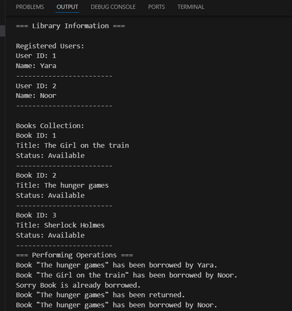

# 📚 Library Management System

A simple yet efficient library management system implemented in Dart, demonstrating Object-Oriented Programming principles.

## 📝 Description

This program implements a basic library system that manages:
- Books and their borrowing status
- Library users
- Borrowing and returning operations
- Information display for all entities

## 🔍 Class Details
1. Book Class:
   - Properties: id, title, borrowed status
   - Methods: displayInfo()
  
2. User Class:
   - Properties: id, name
   - Methods: displayInfo()
  
3. Library Class:
   - Properties: books list, users list
   - Methods: addBook(), addUser(), borrowBook(), returnBook(), displayInfo()

## 📋 Sample Output

 
